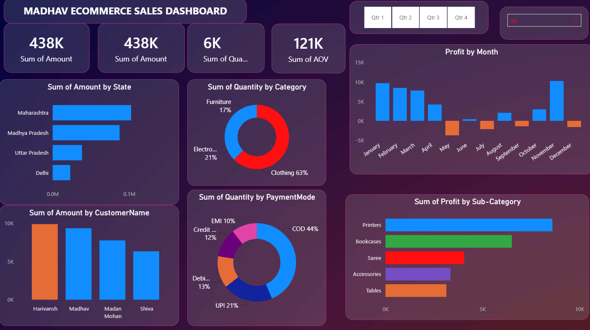

# E-Commerce Sales Analysis

A Power BI report analyzing sales performance for an e-commerce store, built from order and transaction-level data.

## Dashboard Preview

The dashboard includes:
- **KPI cards** — Sum of Amount, Sum of Quantity, Sum of AOV
- **Sum of Amount by State** and **by CustomerName**
- **Sum of Quantity by Category** and **by PaymentMode** (donut charts)
- **Profit by Month** (Jan–Dec trend)
- **Sum of Profit by Sub-Category**
- **Quarter and category slicers** for interactive filtering

## Contents

| File | Description |
|---|---|
| `sales_analyses_for_e_commerce_store.pbix` | Power BI report file with the full data model, DAX measures, and visuals |
| `Orders.csv` | Order-level data — 500 rows |
| `Details.csv` | Transaction/line-item level data — 1,500 rows |

## Data Dictionary

**Orders.csv**
| Column | Description |
|---|---|
| Order ID | Unique order identifier (join key with Details.csv) |
| Order Date | Date the order was placed |
| CustomerName | Name of the customer |
| State | Customer's state |
| City | Customer's city |

**Details.csv**
| Column | Description |
|---|---|
| Order ID | Unique order identifier (join key with Orders.csv) |
| Amount | Order amount (revenue) |
| Profit | Profit earned on the order |
| Quantity | Number of units sold |
| Category | Product category (e.g. Electronics, Furniture) |
| Sub-Category | Product sub-category (e.g. Chairs, Printers) |
| PaymentMode | Payment method used (e.g. COD, EMI, Credit Card) |

`Orders.csv` and `Details.csv` join on **Order ID**, forming a one-to-many relationship (one order can span multiple line items in Details).

## Report

Open `sales_analyses_for_e_commerce_store.pbix` in [Power BI Desktop](https://powerbi.microsoft.com/desktop/) to explore the full report, including data model relationships, DAX measures, and dashboard visuals.

## Requirements

- Power BI Desktop (free) to open and edit the `.pbix` file
